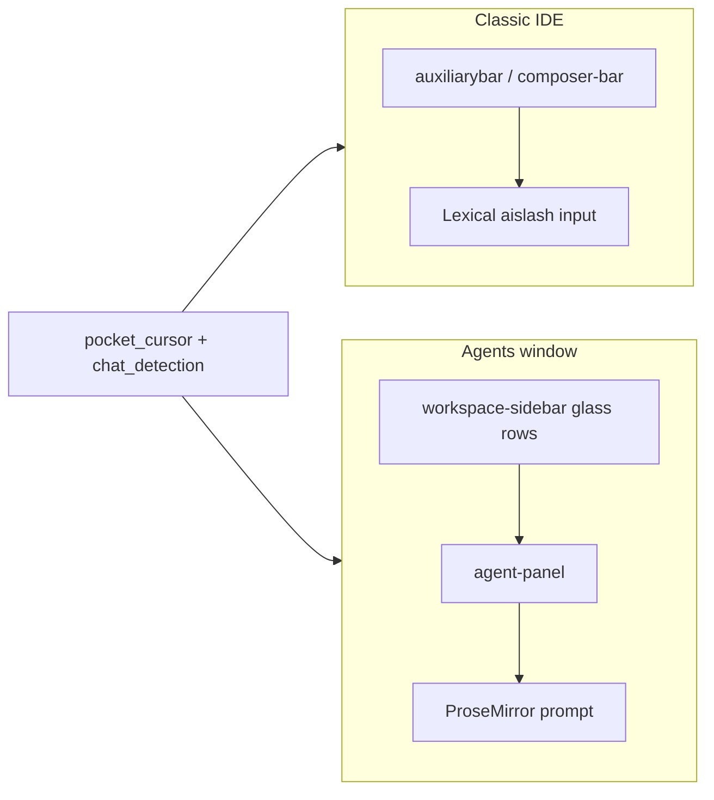

# Agents window (glass UI) support

## What exists today

- **One CDP WebSocket per Electron page target** — [`cdp_list_instances`](pocket_cursor.py) already connects every `page` target (not filtered to `vscode-file://`). A standalone Agents window should already appear as its own registry entry **if** it exposes a normal DevTools page target (verify in practice via `http://localhost:<port>/json` while only the Agents window is open).
- **Chat identity and listing** — [`chat_detection.py`](chat_detection.py) assumes:
  - Composer scope: `.composite.auxiliarybar[data-composer-id]`, `.composer-bar[data-composer-id]`, `.composer-messages-container`
  - Input: `[data-lexical-editor="true"]` inside `.editor-group-container` / auxiliary bar
  - Tabs: `.tab .composer-tab-label`, `[class*="agent-tabs"]`, `.unified-agents-sidebar .agent-sidebar-cell`
- **Send / focus / paste** — [`pocket_cursor.py`](pocket_cursor.py) uses `.aislash-editor-input` or first editable Lexical node, and send via `.send-with-mode …`, `button[aria-label="Send"]`.
- **Turn extraction / screenshots** — large JS blocks assume `.composer-human-ai-pair-container`, `[data-message-role="human"]`, `.aislash-editor-input-readonly`, tool bubbles under `#bubble-*`, etc., often scoped by `[data-composer-id^="…"]`.

## What the Agents window DOM looks like (confirmed)

From your **full** snapshot (sidebar + active conversation + follow-up input):

- **Shell**: `[data-component="root"]`, `nav[data-component="workspace-sidebar"]`, `[data-component="agent-panel"]`, optional `[data-component="editor-panel-container"]` (terminal/diff tabs). Hidden sibling: `div.hidden[data-component="workspaces-container"]` with extra `monaco-workbench` — **must not** be the default query root for composer/message state.

- **Sidebar — list + active agent**: Agent rows are `.glass-sidebar-agent-menu-btn` inside `.glass-sidebar-agent-list-container`; title in `.glass-sidebar-agent-menu-label__name`; group folder in `.ui-sidebar-group-label-text`. **Selected row**: `data-active="true"` on the menu button (e.g. active chat “Docker Coolify instance updates”). Skip `.ui-sidebar-paginated-menu-toggle` (“More”) for listing counts.

- **Top bar title** (redundant check): `.chat-title-tab-title` mirrors the active agent name.

- **Conversation area** (same schema as classic composer): Under `agent-panel`, messages live in `.agent-panel-conversation-shell` → inner `.composer-bar.editor` with **`data-composer-id`** (example: `f8cdaa98-c589-4c38-8c62-fba506d268f3`) and `data-composer-location="pane"`, then `.composer-messages-container`, `.composer-human-ai-pair-container`, `[data-message-role="human"]`, human text still in `.aislash-editor-input-readonly` + Lexical, AI bubbles `#bubble-*`, etc. So **`cid-*` / `composer_prefix` scoping remains valid** once queries are anchored to `agent-panel` (not document-wide).

- **Follow-up prompt** (conversation open): `.agent-panel-followup-input` → `.ui-prompt-input` (`data-variant="compact"`) → TipTap `.ui-prompt-input-editor__input.ProseMirror[contenteditable="true"]` (placeholder “Send follow-up”). **Not** `.aislash-editor-input`. Empty-state layout (from earlier) used expanded `.ui-prompt-input` in `.agent-panel-empty-state-prompt` — implementation should handle **both** roots.

- **Mode / add menu**: `button.ui-prompt-input-plus-button` (`aria-label="Add agents, context, tools"`) opens `div.ui-menu[role="menu"]` with `li.ui-menu__row` / `role="menuitem"` rows whose text includes **Plan**, **Debug**, **Ask** (separate from legacy `composer-mode-*` ids and `.composer-unified-dropdown`).

- **Submit control**: `button.ui-prompt-input-submit-button` still shows `aria-label="Start voice input"` in this snapshot — treat **CDP keyboard send (Enter / Ctrl+Enter)** as the primary glass fallback unless a dedicated Send control appears when the editor is non-empty.

## Multi-workspace semantics (IDE vs Agents window)

**Reality**

- **Classic IDE**: One CDP page ≈ one focused workspace; `parse_instance_title` already maps window title → a single workspace label.
- **Agents window**: One CDP page can list **many** workspaces at once (sidebar sections: `.ui-sidebar-group` + `.ui-sidebar-group-label-text`, e.g. `pocket-cursor`, `maybe`, `estevaz12/pocket-cursor`). Only **one** agent row is **active** at a time; the conversation + `data-composer-id` in `agent-panel` belong to that row.
- **Same logical chat in both**: Cursor may show the same thread in the IDE composer and in the Agents window. Then **`pc_id` / `cid-*` may match** across two **different** `instance_id`s (two CDP targets), but **DOM and focus live in only one window** at a time.

**Recommended approach: unified pipeline, glass-specific branches**

- **Do not** maintain two separate bridges or duplicate high-level flows (send, mirror, forum). Keep **one** `list_chats` listener, **one** mirror model, **one** send path.
- **Do** branch **inside** the injected JS (and small Python helpers) on `isGlassAgentsUi()` — same as today’s pattern for auxiliary bar vs agent-tabs vs unified sidebar.
- **Extend the chat row shape** (not the whole architecture): add an optional field, e.g. `agents_group` (string from the parent section’s `.ui-sidebar-group-label-text`). For IDE-listed chats, omit it or set `null`.
  - **Listing / `/chats`**: Show `agents_group` when present so users see which folder a thread belongs to.
  - **Activation**: When clicking a row, if multiple rows share the same title, match **`(agents_group, name)`** (and still `pc_id` when known).
  - **Mirrors / routes**: Today [`MirrorRow`](pocket_cursor.py) is `(instance_id, pc_id, name, msg_fp)`. Prefer **disambiguation without schema churn** first: include group in `name` for glass-only mirrors (e.g. `maybe / Docker Coolify instance updates`) if collisions are rare. If you need clean display titles, extend persisted route metadata (e.g. optional `agents_group` in `.telegram_routes.json`) and thread it through `cdp_activate_agent_tab` — only if namespacing `name` is insufficient.

**Overlap IDE + Agents (same `pc_id`)**

- **Outbound (Telegram → Cursor)**: Existing logic already prefers **same `instance_id`** when resolving a route; that remains correct — the mirror points at the window the user bound. Two routes may share `pc_id` but differ by `instance_id`; that is intentional if the user wants IDE vs Agents as separate Telegram topics.
- **Dedup**: Optional product choice: if both windows mirror the same forum thread and the same `pc_id`, **inbound** notifications (or “new AI reply” digests) could **dedupe by `(pc_id, msg_id)`** across instances to avoid double posts. Not required for minimal parity; document as follow-up.

**Summary**

| Concern | Approach |
|--------|----------|
| Code structure | **Together** — one codebase, glass branches in JS + narrow Python hooks |
| Workspace identity in Agents | **`agents_group`** (sidebar section) on each listed chat |
| Duplicate titles across sections | Match **group + name** on activate; namespace `name` in mirrors if needed |
| Same thread, IDE + Agents | Distinguish by **`instance_id`**; optional cross-instance notification dedupe later |

## Implementation strategy

### 1. Detect “glass mode” and scope DOM queries

Add a small JS predicate (e.g. `isGlassAgentsUi()`) using `document.body.dataset.cursorGlassMode === 'true'` or visible `[data-component="agent-panel"]`. When true:

- Resolve **`getComposerId` / `conversationFingerprintFromComposer` / `cursor_get_turn_info` scope** from **`[data-component="agent-panel"] .composer-bar[data-composer-id]`** and **`.composer-messages-container`** inside that panel only.
- Resolve **prompt editor** from `.agent-panel .ui-prompt-input-editor__input[contenteditable="true"]` (follow-up and/or empty-state variants).
- Do **not** use the first global `.composer-bar` if it could come from `div.hidden[data-component="workspaces-container"]`.

### 2. Centralize “find the prompt editor”

Today the same fallback chain is copy-pasted in many `Runtime.evaluate` snippets in [`pocket_cursor.py`](pocket_cursor.py) (`cursor_send_message`, `cursor_prefill_input`, `cursor_clear_input`, `cursor_paste_image`, `_cdp_focus_aislash_editor`, etc.).

- Extract one inline helper or shared template string: **inside agent-panel first** (when glass): `.ui-prompt-input-editor__input[contenteditable="true"]` → else classic `.aislash-editor-input` → else visible Lexical in auxiliary/editor group. Optionally prefer `.agent-panel-followup-input` when present so the compact follow-up strip wins over any stray inputs.
- Keeps classic behavior unchanged while adding one maintenance point.

### 3. Send action for glass UI

Full-window snapshot still shows `ui-prompt-input-submit-button` as **voice**, not Send. Plan: try classic send selectors **within `.agent-panel`**, then **`Input.dispatchKeyEvent`** (Enter, then Ctrl+Enter) while the TipTap editor is focused — only after verifying text is in the editor.

### 4. `chat_detection.py`: listing, activation, fingerprints, listener

**`list_chats` / `_LIST_CHATS_JS`**

- Enumerate agents from the glass sidebar: for each `.ui-sidebar-group`, read **section label** from `.ui-sidebar-group-label-text` → emit as **`agents_group`** on every `.glass-sidebar-agent-menu-btn` under that group’s `.glass-sidebar-agent-list-container` (skip `.ui-sidebar-paginated-menu-toggle` “More”).
- **Active row**: `data-active="true"` on `.glass-sidebar-agent-menu-btn` → `active: true` (cross-check optional: `.chat-title-tab-title` text).
- **`pc_id` / `cid-*`**: For the **active** agent, read UUID from **`[data-component="agent-panel"] .composer-bar[data-composer-id]`** and tag the row with `cid-{first8}` (same scheme as today). For **inactive** rows without a loaded composer, keep **`stablePcId('g', idx, groupTitle + '\0' + agentTitle)`** (or similar) so ids stay stable across rebuilds.
- **`msg_id` fingerprint**: Use **`.composer-messages-container` inside `agent-panel`** with the existing human / any-message / `cid:` fallback logic (structure matches classic).

**`findNearestChat` / `extractChatInfo` / `detectChat` (`_LISTENER_JS`)**

- When focus/click is on `.ui-prompt-input-editor__input` or a glass sidebar row, resolve chat name from `.glass-sidebar-agent-menu-label__name` for the **active** row or the clicked row.
- Wire `getComposerId` / `conversationFingerprintFromComposer` to glass-scoped panels so `attachMsgFingerprint` keeps working.

### 5. `cdp_activate_agent_tab` ([`pocket_cursor.py`](pocket_cursor.py))

- After existing strategies, add: find `.glass-sidebar-agent-menu-btn` whose `data-pc-id` matches `targetPcId`, or whose normalized title matches `nameHint` **within the same `agents_group`** when the mirror encodes group (e.g. name prefix `group / title` or a separate argument from route metadata), then `.click()` the row (not Pin/Archive).

### 6. `cursor_new_chat` and agent mode UI

- Glass “New Agent”: `[data-action-id="new-agent"]` on the header sidebar menu button, or `.glass-sidebar-section-label-new-agent-button` per section.
- **Agent mode (glass)**: Open via `.ui-prompt-input-plus-button`, then pick row in `.ui-menu[role="menu"]` — match **Plan / Debug / Ask** on `.ui-menu__row` / `[role="menuitem"]` text (and keep legacy `composer-mode-*` path for classic IDE). **Agent** may be default when not in menu; confirm if a separate row exists when testing.

### 7. `cursor_get_turn_info` and dependent features

- Scope to **`[data-component="agent-panel"] .composer-bar[data-composer-id]`** (or `agent-panel` + `composer_prefix` from active chat): same `.composer-human-ai-pair-container` / `data-message-*` / `.aislash-editor-input-readonly` as classic — **no parallel markdown schema needed** for human bubbles; AI uses `markdown-root` / `markdown-glass-*` in bubbles but existing turn walker may already see text/tool nodes (re-test code blocks / expand buttons against `ui-code-block` if selectors assumed only `.composer-message-codeblock`).

### 8. Instance labeling — **do not skip the Agents window in scans**

[`pocket_cursor.py`](pocket_cursor.py) overview loop does `if not ws_name: continue` before `list_chats`. If the window title is only `"Agents - Cursor"`, [`parse_instance_title`](pocket_cursor.py) returns `None` (needs ≥3 title segments) and **the whole instance is ignored**.

- Extend `parse_instance_title` (or post-process in `cdp_list_instances`) to recognize Agents-only titles and return a synthetic label, e.g. `"(Agents)"` or `"{workspace} (Agents)"` if you can derive workspace from `document.title` / DOM.
- Optionally refine “detached window” notifications when two targets share the same logical workspace (IDE + Agents).

### 9. Verification

- Manual: open Agents window only — confirm it appears in `/json`, gets a non-`None` workspace label, `/chats` lists sidebar agents, Telegram send focuses ProseMirror and sends.
- Manual: IDE + Agents same repo — confirm distinct `instance_id` routing still works.
- Run `npm run validate` after Python edits.
- Add or extend jsdom fixtures under [`tests/`](tests/) if you can snapshot a minimal glass sidebar + prompt HTML (optional; DOM may churn).

## Risk notes

- Cursor can change class names; prefer `data-component`, `data-composer-id`, and `data-active` where possible.
- Pagination (“More”) may hide rows — listing may be incomplete until expanded (document or automate “More” clicks if required).
- Inactive sidebar rows may not have `data-composer-id` in DOM until selected; Telegram routes that need `cid-*` for a specific thread still require that agent to be active once to learn the prefix, or use stable `pc-*` hashes until then.
- Glass AI markdown / code block class names (`ui-code-block`, `markdown-glass-inline-code`) may differ from older composer-only selectors — screenshot and “expand code” paths may need small selector additions after testing.
